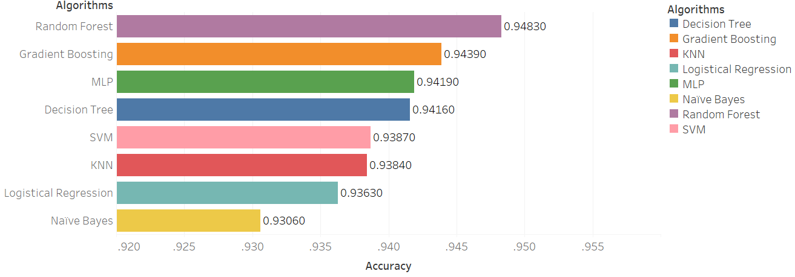

## 1. Overview
The project contains two parts. Machine Learning part is about the prediction of battle result between two pokemons, and Deep Learning part is the image generation using Generative Adversarial Networks. 
## 2. Dependence (pip install)
<pre><code>Numpy 
Pandas 
Tensorflow 
cv2 
matplotlib 
seaborn 
prettytable 
itertools 
scikit-learn 
SciPy </code></pre>
## 3. Machine Learning
### 3.1 Introduction
First we conduct data visualization, feature engineering and elo-rating , then we try several classical machine learning models to predict the combat result. The models include logistical regression, SVM, KNN, Adaboost, MLP and so on. We plot each model’s confusion matrix and ROC curve. 
### 3.2 File
The file contains data and code, the data part contains combats.csv and pokemon.csv.  
The code has five parts: data visualization, feature engineering, elo-rating and algorithms 
### 3.3 Result
The part1/code.ipynb includes all results of our machine learning part. 
 
## 4. Deep Learning
### 4.1 Introduction
We perform image generation by implementing Generative adversarial networks.
### 4.2 File
Code_1 separately generates images of two classical pokemons called pikachu and squirtle using WGAN. 
Code_2 directly generates images of 14000 pokemons using DCGAN. 
### 4.3 Usage
#### Code_1
<pre><code>python resize.py 
python rgb.py 
python GAN.py </code></pre>
#### Code_2
You can use our dataset to train the model by 
<pre><code>python main.py --input_height 64--input_width 64 --output_height 64 --output_width 64 --data pokemon --crop --train --epoch 80 --input_fname_pattern "*.jpg"</code></pre>
Also, you can use your own dataset by 
<pre><code>$ mkdir data/DATA_NAME</code></pre>
Then, add you images into DATA_NAME folder by
<pre><code>python main.py --input_height **--input_width ** --output_height ** --output_width ** --data DATA_NAME --crop --train --epoch 80 --input_fname_pattern "*.jpg"</code></pre>
### 4.4 Result
Pikachu (295 pictures, 5000 epoches, 50 epoches per image) 
 
Squirtle (280 pictures, 5000 epoches, 50 epoches per image) 
 
Pokemons (14000 pictures, 80 epoches, 1 epoch per image) 
 
Final Result 
 
## 5. Credit
[Part_1 dataset](https://www.kaggle.com/terminus7/pokemon-challenge) 
[Part_2 dataset](https://www.kaggle.com/thedagger/pokemon-generation-one) 
[Part_1 code](https://github.com/llSourcell/Pokemon_GAN) 
[Part_2 code](https://github.com/carpedm20/DCGAN-tensorflow) 
[Unsupervised Representation Learning with Deep Convolutional Generative Adversarial Networks](https://arxiv.org/abs/1511.06434) 
https://medium.com/@yvanscher/using-gans-to-create-monsters-for-your-game-c1a3ece2f0a0 
https://zhuanlan.zhihu.com/p/24767059 
